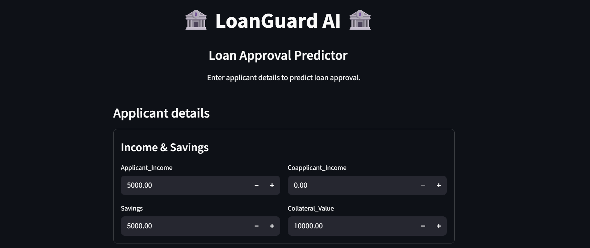
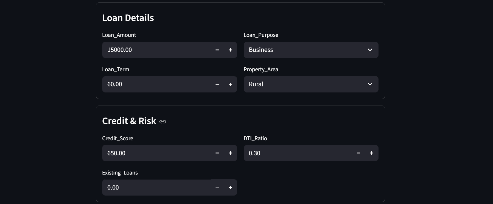
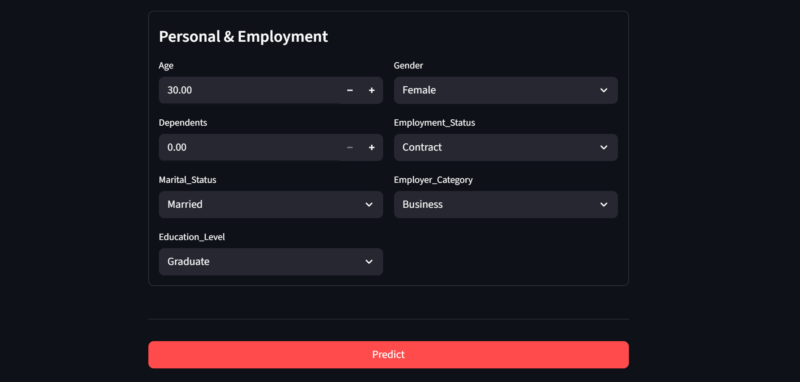

# LoanGuard — Loan Approval System

`LoanGuard` is an intelligent loan approval system that predicts whether a loan application should be **Approved** or **Rejected** using historical application data.

## Quick start (Streamlit UI)

### Clone

```bash
git clone https://github.com/HelloShiwansh/LoanGuard-AI
cd "LoanGuard AI - Loan Approval System"
```

### Install

```bash
pip install -r requirements.txt
```

### Train (creates local model artifacts)

```bash
python train_and_save.py
```

This generates:
- `artifacts/loan_approval_model.joblib`
- `artifacts/model_meta.joblib`

### Run the app

```bash
streamlit run app.py
```


Short overview
--
LoanGuard is an end‑to‑end **loan approval prediction** project. It takes an applicant’s details (income, loan details, credit/risk indicators, and demographic/employment information) and predicts whether the loan is likely to be **Approved (Yes)** or **Not Approved (No)**.

### What problem it solves
- **Goal**: assist banks/loan officers by providing a fast, consistent approval recommendation based on historical patterns.
- **Output**: a binary decision (**Approved / Not Approved**) plus a **probability of approval** (model confidence).

### Dataset
The dataset (`LoanGuard_data.csv`) contains historical applications with the target column:
- **`Loan_Approved`**: `Yes` / `No`

The UI collects the same input columns (excluding `Applicant_ID`), including:
- **Income & savings**: `Applicant_Income`, `Coapplicant_Income`, `Savings`, `Collateral_Value`
- **Loan details**: `Loan_Amount`, `Loan_Term`, `Loan_Purpose`, `Property_Area`
- **Credit & risk**: `Credit_Score`, `DTI_Ratio`, `Existing_Loans`
- **Personal & employment**: `Age`, `Dependents`, `Marital_Status`, `Education_Level`, `Gender`, `Employment_Status`, `Employer_Category`

### Model & pipeline (current app)
The Streamlit app uses a **Logistic Regression** model packaged as a single pipeline that reproduces the notebook’s preprocessing:
- **Missing values**:
  - numeric → mean imputation
  - categorical → most frequent imputation
- **Encoding**:
  - one‑hot encoding for nominal fields (Employment/Marital/Purpose/Area/Gender/Employer category)
  - ordinal encoding for `Education_Level`
- **Feature engineering**:
  - adds `DTI_Ratio_sq` and `Credit_Score_sq`
  - then drops `DTI_Ratio` and `Credit_Score` (keeping their squared versions)
- **Scaling**: StandardScaler
- **Prediction**:
  - decision from `model.predict(...)`
  - probability from `model.predict_proba(...)[..., 1]` (probability of approval / class `Yes`)

### Notebook flow (`LoanGuard.ipynb`)
The notebook is the main project workflow. High level steps:

1. **Load dataset + basic checks**
   - Inspect schema and distributions.
2. **Handle missing values**
   - Numeric columns → mean imputation (`SimpleImputer(strategy="mean")`)
   - Categorical columns → most frequent imputation (`SimpleImputer(strategy="most_frequent")`)
3. **Drop identifier column**
   - `Applicant_ID` is removed (it’s an identifier, not a predictive feature).
4. **Feature encoding**
   - `Education_Level` encoded to numeric (label/ordinal style encoding).
   - Nominal categorical columns one‑hot encoded with `drop="first"` to avoid redundancy.
5. **Baseline modeling**
   - Train/test split + scaling.
   - Train and evaluate: Logistic Regression, KNN, Gaussian Naive Bayes.
6. **Feature engineering (improves Logistic Regression)**
   - Add: `DTI_Ratio_sq = DTI_Ratio ** 2` and `Credit_Score_sq = Credit_Score ** 2`
   - Drop original `DTI_Ratio` and `Credit_Score` and keep squared versions.
   - Retrain and evaluate models again.
7. **Final selection**
   - Logistic Regression after feature engineering gives the best overall performance in the notebook and is used in the UI.


Results (comparison table)
--
The metrics below come from the notebook outputs.

| Algorithm | Precision | Recall | F1-score | Accuracy | Notes |
|---|---:|---:|---:|---:|---|
| Logistic Regression (baseline) | 0.7514 | 0.5673 | 0.6465 | 0.8100 | Baseline after encoding + scaling |
| K-Nearest Neighbors (baseline) | 0.6593 | 0.3633 | 0.4684 | 0.7475 | Weaker recall/F1 in baseline |
| Gaussian Naive Bayes (baseline) | 0.8393 | 0.5755 | 0.6828 | 0.8363 | Strong baseline accuracy |
| Logistic Regression (after FE) | 0.7903 | 0.8033 | 0.7967 | 0.8750 | Best overall after feature engineering |
| K-Nearest Neighbors (after FE) | 0.6275 | 0.5246 | 0.5714 | 0.7600 | Improves vs baseline but below Logistic |
| Gaussian Naive Bayes (after FE) | 0.7833 | 0.7705 | 0.7769 | 0.8650 | Strong, but below Logistic after FE |


Interpretation guidance
--
- Compare models on F1-score when classes are imbalanced; prefer higher F1 for balanced precision/recall.
- If interpretability is a priority for manual review, prefer Logistic Regression or decision-tree-based models.
- If performance (AUC/F1) is the sole priority, consider adding tree ensembles (Random Forest, XGBoost) and hyperparameter tuning.


Conclusion
--
- The notebook shows that **feature engineering** (adding squared terms for `DTI_Ratio` and `Credit_Score`) significantly improves performance.
- With this FE, **Logistic Regression** achieves the best overall results in the notebook (**Accuracy 0.875, F1 0.797**), while remaining easy to interpret and explain.
- The Streamlit UI is a lightweight deployment layer that:
  - collects the same input features as the dataset (excluding `Applicant_ID`)
  - runs the saved pipeline
  - displays **Approved / Not Approved** along with **approval probability**.

---

## Repository contents

- `app.py`: Streamlit UI (inputs from dataset columns except `Applicant_ID`)
- `train_and_save.py`: trains Logistic Regression pipeline + saves artifacts
- `loan_model.py`: custom feature engineering transformer used by the pipeline
- `LoanGuard.ipynb`: notebook with EDA / training experiments
- `LoanGuard_data.csv`: dataset
- `Docs/`: dataset description + problem statement

---

## UI screenshots





---

*Made by Shiwansh*